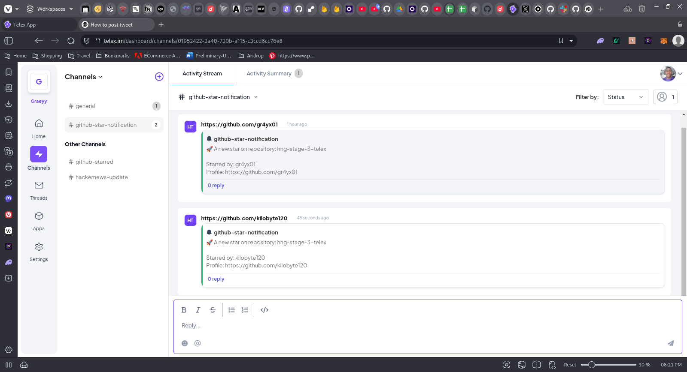

# Github Repository Star Notifier

A FastAPI application that receives an event from Github when this repository is starred, and follow who starred the repo.

## Project Structure

## Installation

1. Clone the repository:

   ```sh
   git clone https://github.com/gr4yx01/hng-stage-3-telex.git
   cd hng-stage-3-telex
   ```

2. Create a virtual environment and activate it:

   ```sh
   python -m venv venv
   source venv/bin/activate  # On Windows use `venv\Scripts\activate`
   ```

3. Install the dependencies:

   ```sh
   pip install -r requirements.txt
   ```

## Usage

1. Run the FastAPI application:

   ```sh
   uvicorn main:app --reload
   ```

2. The application will be available at `http://127.0.0.1:8000`.

## API Endpoints

### Get Integration JSON

- **URL:** `/application.json`
- **Method:** `GET`
- **Response:**
  ```json
  "data": {
    "date": {
      "created_at": "2025-02-20",
      "updated_at": "2025-02-20"
    },
    "descriptions": {
      "app_name": "github-star-notifier",
      "app_description": "This integration notifies my channel of a starred event on my repository",
      "app_logo": "https://www.pinterest.com/pin/883690758133210277/",
      "app_url": "https://p7hr5wrm-8000.uks1.devtunnels.ms",
      "background_color": "#fff"
    },
    "is_active": True,
    "integration_type": "modifier",
    "integration_category": "Task Automation",
    "key_features": [
      "real time notification"
    ],
    "author": "Graeyy",
    "settings": [
      {
        "label": "event_type",
        "type": "dropdown",
        "required": True,
        "default": "unstarred",
        "options": [
          "starred",
          "unstarred"
        ]
      }
    ],
    "target_url": "https://p7hr5wrm-8000.uks1.devtunnels.ms/webhook",
  }
  ```

### Testing webhook manually

- **URL:** `/application.json`
- **Method:** `POST`
- **Response:**
  ```json
    {
        'status': 'success',
        'status_code': 202,
        'message': 'request received',
        'task_id': '8ec80144-74de-410a-815f-62b5e8492271'
    }
  ```

# Integration Description
    This is integration is a modifier, which basically listens for github star notification on my created channel, then using the webhook specified in the target url, triggers to follow the user who starred the repository.

# Image

        
    You could test it out by giving my repository a star, and it'd follow automatically.


## License

This project is licensed under the MIT License.
